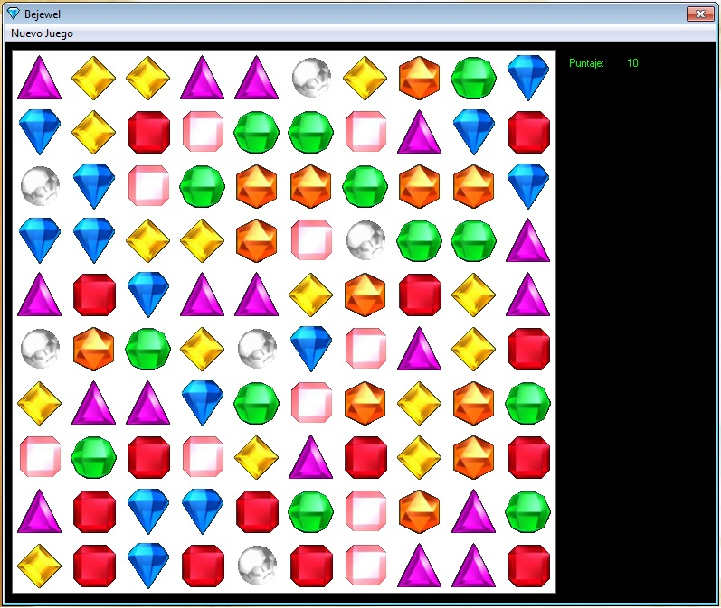



## Bejewel Example

### Description

Just a simple example on how to make a Bejewel game type.
 
### More Info
 

             |
---                |---
**Submitted On**   |2011-11-25 22:22:42
**By**             |[Julio C\. Gotuzzo](https://github.com/Planet-Source-Code/PSCIndex/blob/master/ByAuthor/julio-c-gotuzzo.md)
**Level**          |Advanced
**User Rating**    |4.7 (14 globes from 3 users)
**Compatibility**  |VB 6\.0
**Category**       |[Games](https://github.com/Planet-Source-Code/PSCIndex/blob/master/ByCategory/games__1-38.md)
**World**          |[Visual Basic](https://github.com/Planet-Source-Code/PSCIndex/blob/master/ByWorld/visual-basic.md)
**Archive File**   |[Bejewel\_Ex22154911252011\.zip](https://github.com/Planet-Source-Code/julio-c-gotuzzo-bejewel-example__1-74182/archive/master.zip)

